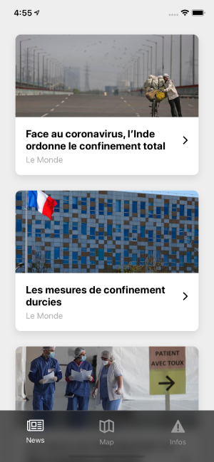
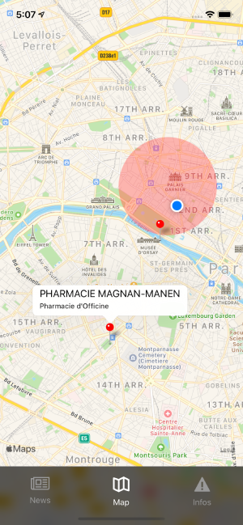
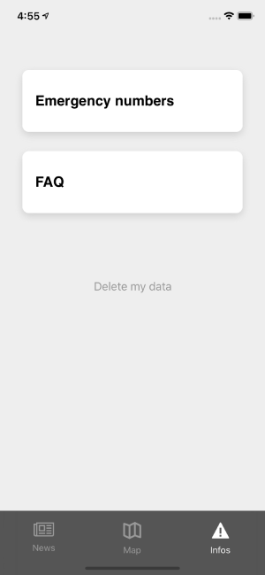

# COVID-19 app

* [Purpose](#purpose)
* [Features](#features)
* [Screenshots](#screenshots)
* [Going further](#going-further)
* [Getting started](#getting-started)
  * [Installation](#installation)
  * [Configuration](#configuration)
  * [Running locally](#running-locally)
* [Deployment](#deployment)
* [API specifications](#api-specifications)

# Purpose 

This app has been developed as a starting point for volunteers
and organizations willing to provide a tool or a companion to
a group of people (even countrywide!) during the COVID-19 crisis.

This project is greatly inspired by the `advice_app` proposal on [Working with Helpful Engineers](https://github.com/helpfulengineering/resources/blob/master/software/proposals/advice_app.md).

# Features

Out-of-the-box it provides five main features :

- **Newsfeed**, to centralize (external) articles and decrease confusion.
- **Map**, to display pins and circles. For example: pharmacies, hospitals, 
zones in quarantine, etc.
- **Infos**, to provide advices, emergency numbers, and more.
- **Geolocation tracker**. Completely anonymous, we added this feature so you can
display geo-specific newsfeed, map or infos.
- **Push Notifications** through Firebase, to inform everyone of something.

Every feature is designed to deliver dynamic data, from your own API.
That way, you don't have to update this app to change something on the map,
deliver some news or edit some infos.

This app is open-source and completely free. 🎁

# Screenshots





# Going further

Here are some ideas you may find interesting if you wish to add some features to this app.

- Create a "Profile" tab, to collect users' health status in order to display zones with
the disease on the map.
- Use Google Maps on Android & iOS to implement Heatmap.
- _You have an idea? Create an Issue or a Pull Request!_ 

# Getting started

## Requirement

- React Native CLI (`npx react-native`)
- Xcode (macOS only) _- Required for iOS deployments._
- Android Studio _- Required for Android deployments._
- Firebase project (for Push Notifications)
- [Your own API](#api-specifications) or [our example API](https://github.com/bluesquare-io/covid-19-server)

## Installation

```
yarn 
cd ios && pod install && cd .. // iOS only
npx react-native link react-native-vector-icons
```

## Configuration

### API

Add your API endpoints in `app.json`.

### Android

1. Firebase: create an Android version
2. Add your `google-services.json` in `android/app/`
3. _(optional)_ Replace `YOUR_GOOGLE_MAPS_API_KEY` in `AndroidManifest.xml`

### iOS

1. Firebase: create an iOS version
2. Add your `GoogleService-Info.plist` in `ios/` (using Xcode)
3. _(optional)_ Replace `YOUR_GOOGLE_MAPS_API_KEY` in `AppDelegate.m`

## Running locally

```
npx react-native run-ios
npx react-native run-android
```

# Deployment

_(comming soon)_

# API specifications

`POST /api/token` : register device and get an API token.
```
BODY
{
    "device_uuid": "EXAMPLE_DEVICE_UUID"
}
DATA 200
{
    "token": "EXAMPLE_TOKEN"
}
```

For the following endpoints, an `Authorization` header, containing `Bearer EXAMPLE_TOKEN` is attached to every request.

`DELETE /api/token` : delete every data linked to a token.
```
DATA 200
{
    "success": true
}
```

`GET /api/newsfeed?page=1` : retrieve news.
```
DATA 200
{
    "page": 1,
    "data": [
        {
            "id": 1,
            "title": "Example article",
            "description": "Example summary",
            "source": "https://url/of/the/article",
            "picture": "https://url/to/optional/illustration",
            "news_feed": {
                "name": "Wall Street Journal"
            }
        },
        // ...
    ]
}
```

`POST /api/map` : retrieve pins and circle for a specific bounding-box.
```
BODY
{
    "region": {
        "latitude": 48.866,
        "longitude": 2.333,
        "latitudeDelta": 0.53333,
        "longitudeDelta": 0.43333
    }
}
DATA 200
[
    {
        "id": "pin-1",
        "type": "pin",
        "latitude": 48.866,
        "longitude": 2.333,
        "color": "red",
        "title": "My pin",
        "description": "My pin description",
        "popup": {
            "name": "My pin",
            "address": "address of my pin",
            "zipcode": "75000",
            "city": "Paris",
            "country": "FR",
            "phone": "cellphone of my pin"
        }
    },
    {
        "id": "circle-1",
        "type": "circle",
        "latitude": 48.866,
        "longitude": 2.333,
        "radius": 1000,
        "color": "rgba(0,0,0,0.5)"
    },
    // ...
]
```

_Note: `popup` is optional._


`POST /api/track` : log the device geolocation.
```
BODY
{
    "position": {
        "latitude": 48.866,
        "longitude": 2.333
    }
}
DATA 200
{
    "success": true
}
```

For the following endpoint, a `?token=EXAMPLE_TOKEN` query parameter is attached.

`GET /infos` : display a web-page. _This is not a real endpoint. This URL is opened in a WebView._
